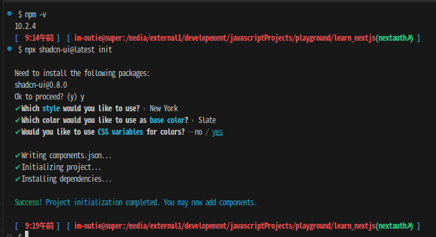

### node upgrade using nvm

最新版のインストール

```sh
nvm install node # "node" is an alias for the latest version
```

### nextjs install

```sh
npx create-next-app@latest my-app --typescript --tailwind --eslint
```

### tailwindcss

[tailwindcss setup](https://tailwindcss.com/docs/guides/nextjs)

[prettier](https://tailwindcss.com/blog/automatic-class-sorting-with-prettier)

### nextauth

```sh
npm install next-auth
```

### callback

```
http://localhost:3000/api/auth/callback/google
```

### shadcn

[shadcn](https://ui.shadcn.com/docs/installation/next)



```sh
npx shadcn-ui@latest add button
```

login new-password 等の諸々に CardWrapper を使って統一する

```sh
npx shadcn-ui@latest add card
```

フォームの追加
`react-hook-form`や`zod`などを追加してくれる

```sh
npx shadcn-ui@latest add form
npx shadcn-ui@latest add input
```

### react-icons

Google, Githubなどのアイコンをまとめたパッケージを使う

```sh
npm i react-icons
```
